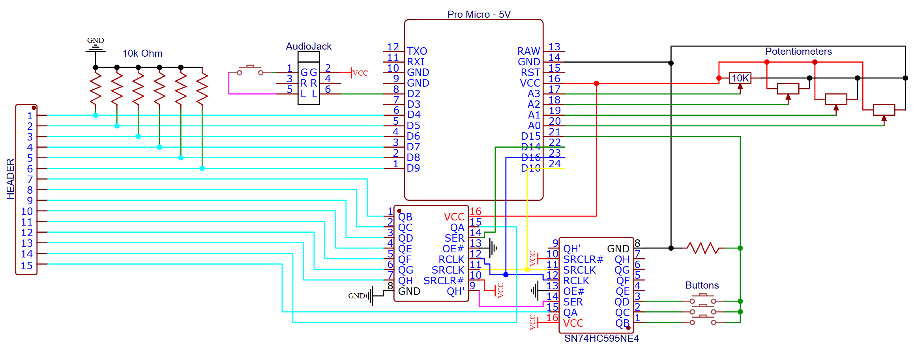

# Arduino-MIDI-keyboard

Turn old toy keyboard (CASIO ToneBank MA-120) into a fully functional MIDI synth for music production.

## Circuit Diagram Version 1

## Circuit Diagram Version 2

## Final result

https://github.com/A01706702/Arduino-MIDI-keyboard/assets/65085262/0da4adef-ebb8-43b7-9c0b-2581038c9dfc

